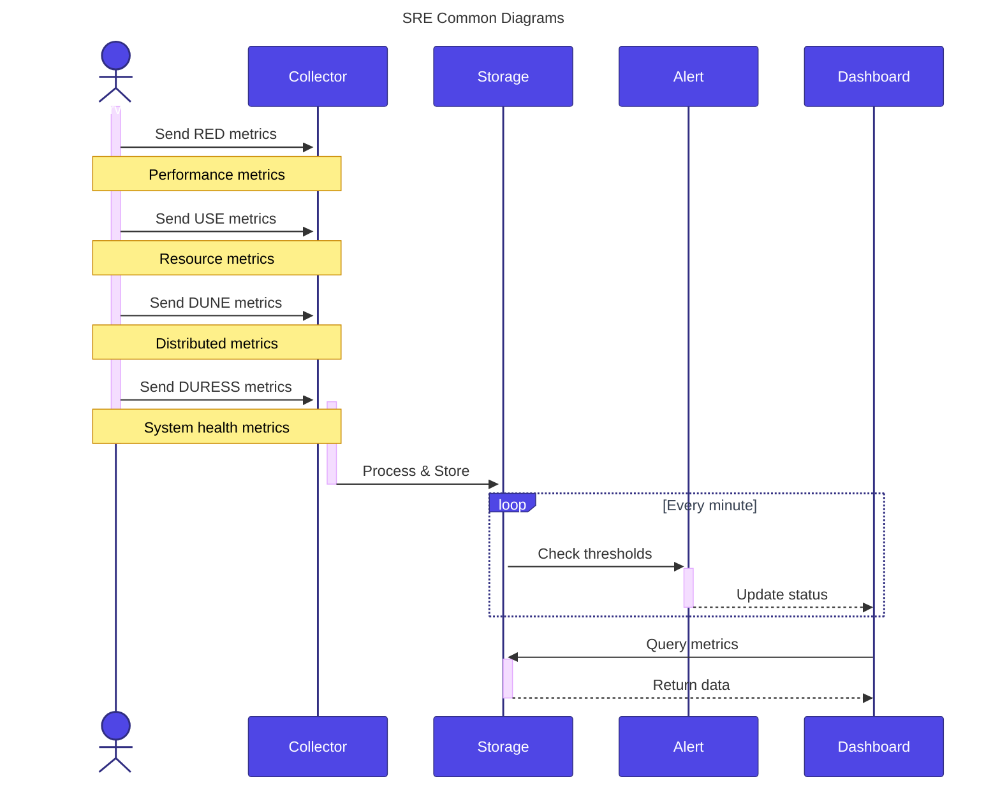
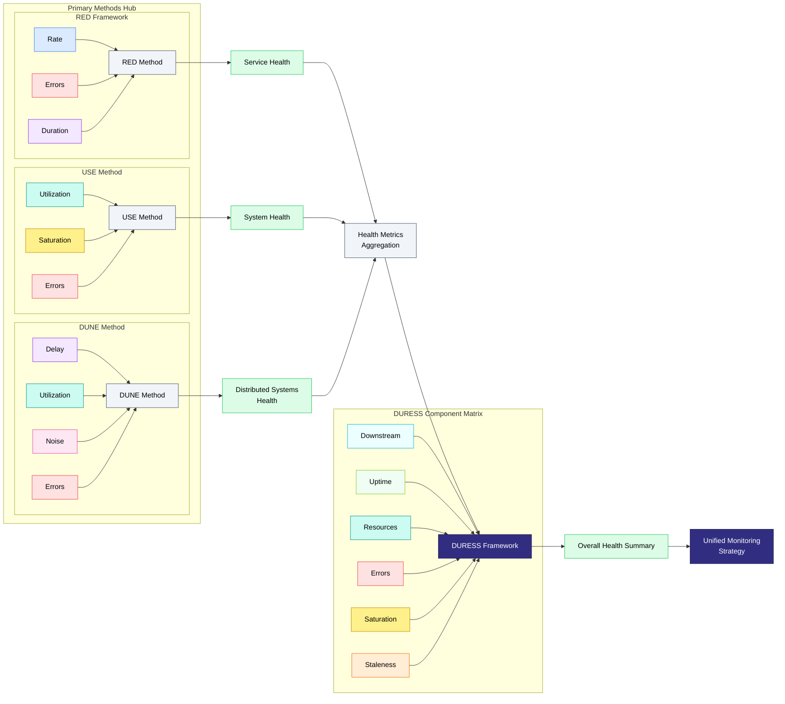

# SRE Common Diagrams

```mermaid
---
title: SRE Common Diagrams
---

%%{init: { 'theme': 'base', 'themeVariables': {
    'actorBkg': '#4F46E5',
    'actorTextColor': '#fff',
    'actorBorder': '#312E81',
    'actorLineColor': '#312E81',
    
    'participantBkg': '#DBEAFE',
    'participantTextColor': '#000',
    'participantBorder': '#3B82F6',
    
    'messageFontSize': '14px',
    'messageFontFamily': 'ui-sans-serif, system-ui',
    'messageTextColor': '#111827',
    
    'noteBkgColor': '#FEF08A',
    'noteTextColor': '#000',
    'noteBorderColor': '#CA8A04',
    
    'loopTextColor': '#374151',
    'loopBorderColor': '#F97316',
    'loopBkgColor': '#FFEDD5',
    
    'mainBkg': '#FAFAFA'
}}}%%

sequenceDiagram
    actor Service
    participant Collector
    participant Storage
    participant Alert
    participant Dashboard
    
    activate Service
    Service->>+Collector: Send RED metrics
    Note over Service,Collector: Performance metrics
    Service->>+Collector: Send USE metrics
    Note over Service,Collector: Resource metrics
    Service->>+Collector: Send DUNE metrics
    Note over Service,Collector: Distributed metrics
    Service->>+Collector: Send DURESS metrics
    Note over Service,Collector: System health metrics
    deactivate Service
    
    Collector->>+Storage: Process & Store
    deactivate Collector
    
    loop Every minute
        Storage->>+Alert: Check thresholds
        Alert-->>-Dashboard: Update status
    end
    
    Dashboard->>+Storage: Query metrics
    Storage-->>-Dashboard: Return data

```

## Relationship between frameworks

```mermaid
graph LR
    subgraph Primary Methods ["Primary Methods Hub"]
        direction TB
        
        subgraph RED Framework
            R["Rate"]:::blue --> RED["RED Method"]:::slate
            E1["Errors"]:::red --> RED
            D1["Duration"]:::purple --> RED
        end
        
        subgraph USE Method
            U1["Utilization"]:::teal --> USE["USE Method"]:::slate
            S1["Saturation"]:::yellow --> USE
            E2["Errors"]:::red --> USE
        end
        
        subgraph DUNE Method
            D2["Delay"]:::purple --> DUNE["DUNE Method"]:::slate
            U2["Utilization"]:::teal --> DUNE
            N["Noise"]:::pink --> DUNE
            E3["Errors"]:::red --> DUNE
        end
    end
    
    RED --> ServiceHealth["Service Health"]:::green
    USE --> SystemHealth["System Health"]:::green
    DUNE --> DistributedHealth["Distributed Systems<br>Health"]:::green
    
    ServiceHealth --> Aggregation["Health Metrics<br>Aggregation"]:::slate
    SystemHealth --> Aggregation
    DistributedHealth --> Aggregation
    
    Aggregation --> DURESS["DURESS Framework"]:::indigowhite
    
    subgraph DURESS System ["DURESS Component Matrix"]
        D3["Downstream"]:::cyan --> DURESS
        U3["Uptime"]:::lime --> DURESS
        R1["Resources"]:::teal --> DURESS
        E4["Errors"]:::red --> DURESS
        S2["Saturation"]:::yellow --> DURESS
        S3["Staleness"]:::orange --> DURESS
    end
    
    DURESS --> OverallHealth["Overall Health Summary"]:::green
    OverallHealth --> MonitoringStrategy["Unified Monitoring<br>Strategy"]:::indigowhite

    %% Standardised Class Library Definitions
    classDef red fill:#FEE2E2,stroke:#EF4444,color:#000
    classDef orange fill:#FFEDD5,stroke:#F97316,color:#000
    classDef yellow fill:#FEF08A,stroke:#CA8A04,color:#000
    classDef green fill:#DCFCE7,stroke:#22C55E,color:#000
    classDef teal fill:#CCFBF1,stroke:#0D9488,color:#000
    classDef blue fill:#DBEAFE,stroke:#3B82F6,color:#000
    classDef purple fill:#F3E8FF,stroke:#9333EA,color:#000
    classDef pink fill:#FCE7F3,stroke:#EC4899,color:#000
    classDef lime fill:#F0FDF4,stroke:#84CC16,color:#000
    classDef cyan fill:#ECFEFF,stroke:#06B6D4,color:#000
    classDef slate fill:#F1F5F9,stroke:#475569,color:#000
    classDef indigowhite fill:#312E81,stroke:#1E1B4B,color:#FFF

```
